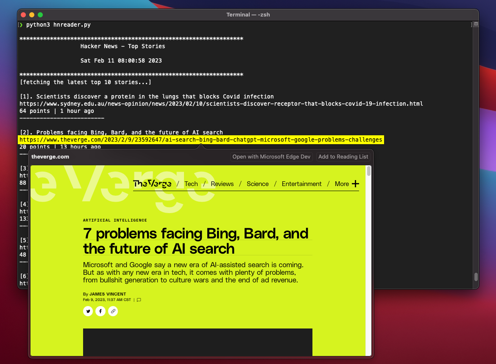

# Hacker News Reader

Fetch Hacker News top stories right from your terminal.

## Pre-requisites

1. Verify you have Python 3 installed:

```bash
   $ python --version
```
   - If not installed, download Python [here](https://www.python.org/downloads/)

## Running the program

Clone this repository to your machine. Then create a python virtual environment as follows:

1. On your terminal, navigate to the repository's root directory. Then execute:

   ```bash
   python -m venv <venv_name>
   ```
   where <venv_name> is the name you want to give the virtual environment

2. To activate the environment:

      On MacOS/Linux execute:

   ```bash
   source <venv_name>/bin/activate
   ```
      On Windows execute:

   ```bash
   .\<venv_name>\Scripts\activate
   ```

3. With the virtual environment active, install the required libraries with pip:

    ```bash
    pip install -r ./requirements.txt
    ```

4. Execute the program:

```bash
   $ python3 hnreader.py
```
This will fetch the latest top 10 stories.

4. You can specify the number of stories to fetch with the `-q` or `--quantity` flag:

```bash
   $ python3 hnreader.py -q 25
```
This will fetch the latest top 25 stories

5. Depending on your terminal: Ctr+click, Cmd+click, or just click on the link in the story to open it in a browser.
   -  If using zsh on macOS, you can preview the story without opening a browser:
      -  Ctrl+click on the url, then select Quick Look:



*Note*: The max number of stories is 500 per the Hacker News API limit.

6. Alternatively, you can run the file directly:

```bash
   $ ./hnreader.py
```

## Screen views

### Usage

```
$ python3 hnreader.py -h
usage: hnreader [-h] [-q]

Fetch the latest top stories from Hacker News

optional arguments:
  -h, --help        show this help message and exit
  -q , --quantity   The number of stories to display (max is 500). If not provided, the default is 10.
```

### Fetching stories

```
$ python3 hnreader.py -q 5

******************************************************************
                  Hacker News - Top Stories

                  Fri Feb 10 10:47:44 2023

******************************************************************
[fetching the latest top 5 stories...]

[1]. “Open Source” Seeds Loosen Big Ag’s Grip on Farmers
https://worldsensorium.com/open-source-seeds-loosen-big-ags-grip-on-farmers/
207 points | 2 hours ago
-------------------------

[2]. Is Seattle a 15-minute city? It depends on where you want to walk
https://nathenry.com/writing/2023-02-07-seattle-walkability.html
102 points | 1 hour ago
-------------------------

[3]. Show HN: Spaghettify – A VSCode Extension to make your code worse with AI
https://www.spaghettify.dev/
74 points | 1 hour ago
-------------------------

[4]. Manticore 6.0.0 – a faster alternative to Elasticsearch in C++
https://manticoresearch.com/blog/manticore-search-6-0-0/
47 points | 1 hour ago
-------------------------

[5]. Show HN: Dslcad a programming language and interpreter for building 3D models
https://github.com/DSchroer/dslcad
53 points | 1 hour ago
-------------------------

```